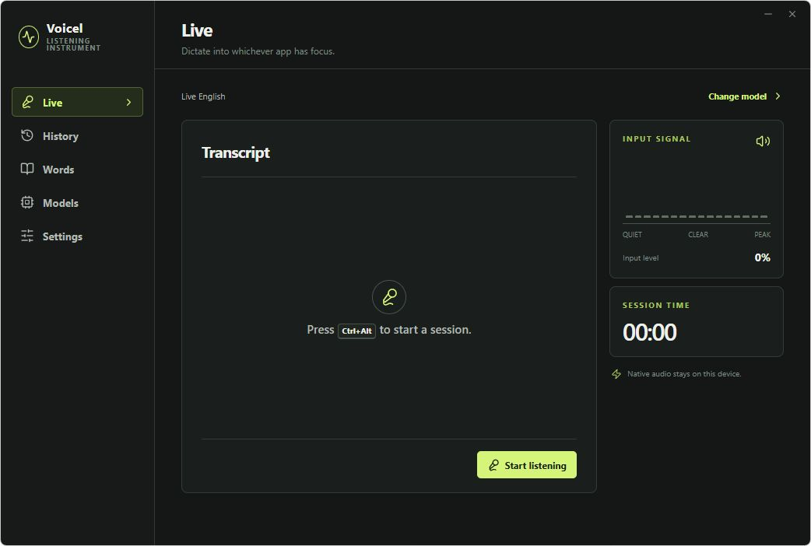
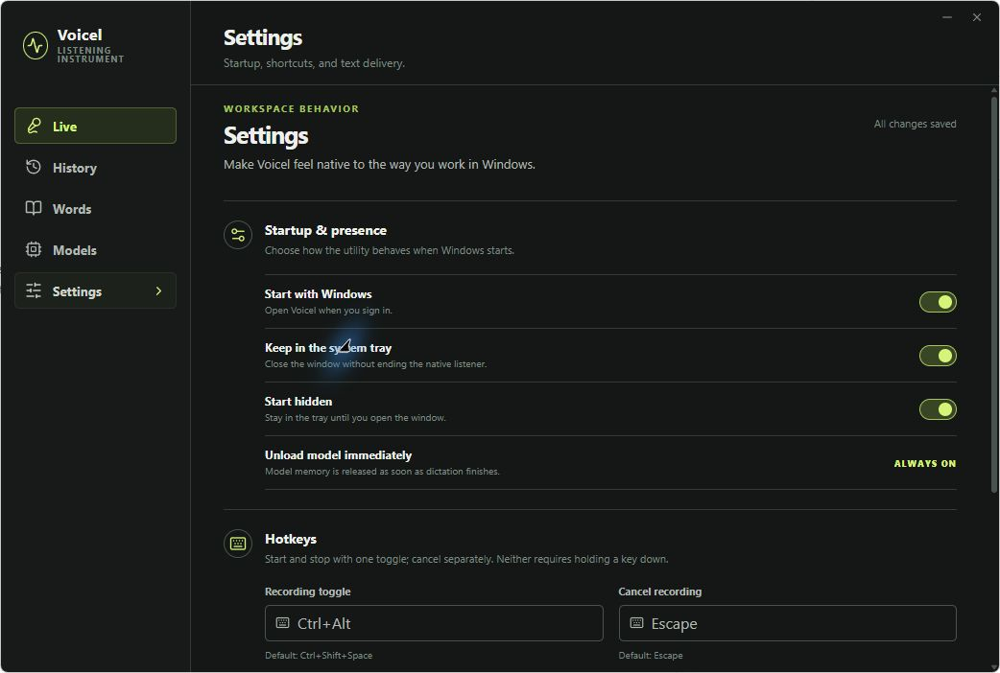

# Voicel

Voicel is a local Windows dictation utility built around visible, low-latency transcription. Press one global shortcut to start, press it again to finish and insert, or press the separate cancel shortcut to discard the session.

## Screenshots

### Live dictation



### Settings



## Why two model modes?

- **Live English** uses sherpa-onnx's online Zipformer recognizer. It is genuinely stateful streaming: audio is decoded as it arrives.
- **Parakeet v3** keeps NVIDIA's accurate 25-language model available. Its public ONNX artifact is offline-only, so Voicel runs bounded overlapping windows and labels the result **Incremental**, not streaming.

Both modes run locally on CPU through one inference runtime. Audio is never uploaded.

## Included workflow

- Toggle recording and separate cancel shortcuts; no push-to-talk mode.
- Non-activating always-on-top recording overlay.
- Tray operation, start hidden, and launch at Windows sign-in.
- Immediate model and microphone release after finalization or cancellation.
- Receipt-sequenced `Ctrl+V` insertion that restores the previous clipboard after the target application reads the transcript.
- Literal typing for fields that reject clipboard insertion.
- Custom vocabulary and a bounded one-to-three transcript history.
- Versioned, atomic settings stored outside the installation directory so app updates cannot reset them.

## Development

Requirements: Windows 10/11 x64, Rust, Node.js, pnpm, and the WebView2 runtime.

```powershell
pnpm install
pnpm tauri dev
```

Build an installer with:

```powershell
pnpm tauri build
```

The first Rust build downloads the matching sherpa-onnx static runtime. Speech models are downloaded only when selected in Voicel.

## Model sources and licenses

- [Streaming Zipformer English](https://k2-fsa.github.io/sherpa/onnx/pretrained_models/online-transducer/zipformer-transducer-models.html), distributed through the sherpa-onnx model release.
- [NVIDIA Parakeet TDT 0.6B v3](https://huggingface.co/nvidia/parakeet-tdt-0.6b-v3), licensed CC BY 4.0.
- [sherpa-onnx](https://github.com/k2-fsa/sherpa-onnx), licensed Apache 2.0.

Product and implementation contracts live in [docs/PRODUCT.md](docs/PRODUCT.md) and [docs/ARCHITECTURE.md](docs/ARCHITECTURE.md).
